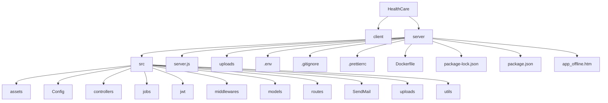

# HealthCare Project Architecture

Dưới đây là sơ đồ cấu trúc dự án HealthCare theo hình ảnh bạn cung cấp.

### Cấu trúc thư mục dạng cây

- HealthCare
  - client
  - server
    - src
      - assets
      - Config
      - controllers
      - jobs
      - jwt
      - middlewares
      - models
      - routes
      - SendMail
      - uploads
      - utils
    - server.js
    - uploads
    - .env
    - .gitignore
    - .prettierrc
    - Dockerfile
    - package-lock.json
    - package.json
    - app_offline.htm
